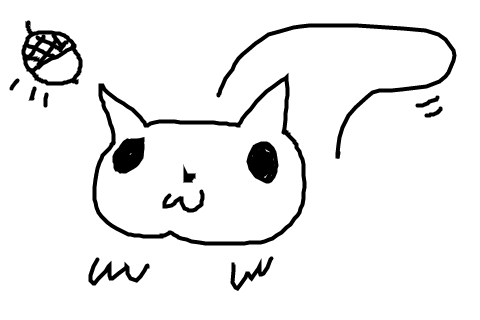

# Dog Dog Crow Crow

### This project is under construction.. check back soon ❤️

#### A game about a squirrel created by Drew Anderson (MoHDI) and Jeremy Kale Padot
[modhi](https://www.mohdi.com) [kale](https://www.kalepadot.com)
#### June 2020

#### Install this application

_Clone this repository via Terminal using the following commands:_
* _$ cd desktop_
* _$ git clone {url to this repository}_
* _$ cd DogDogCrowCrow
_Then, confirm that you have navigated to the DogDogCrowCrow project directory by entering "pwd" in Terminal._

_Next, install npm at the project's root directory via the following commands:_
* _$ npm install_
* _$ npm run build_

_Open the contents of the directory in a text editor or IDE of your choice (e.g., to open the contents of the directory in Visual Studio Code on macOS, enter the command "code ." in Terminal)._

## Available Scripts

In the project directory, you can run: _pending_

### `npm start`

Runs the app in the development mode. 
Open [http://localhost:3000](http://localhost:3000) to view it in the browser.

The page will reload if you make edits. 
You will also see any lint errors in the console.

## Technologies Used

* Git
* JavaScript
* npm
* Webpack
* Adobe Packages
* Affinity Designer
* Phaser

### License

*This webpage is licensed under the MIT license.*

Copyright (c) 2020 **_Jeremy Kale Padot & MOHDI_**
